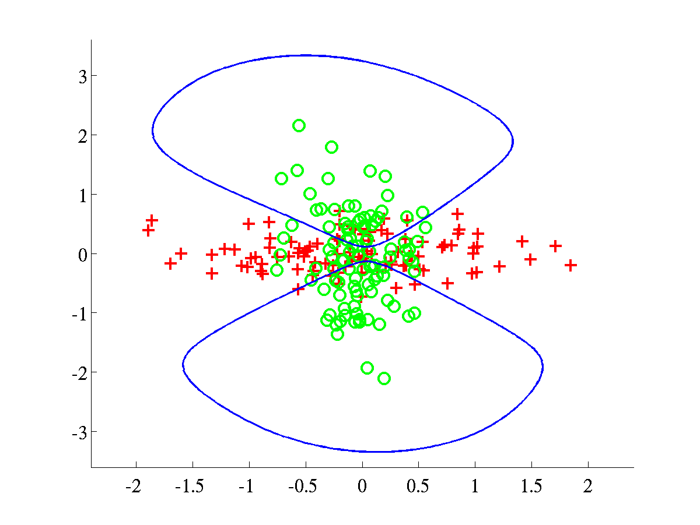

Bayesian Fisher's discriminant
==============================

This page describes how to use the so-called Bayesian Fisher
Discriminant (BFD) software.

Please note that in the subsequent discussion we will be using these
references:\
1.  T. Peña-Centeno and N. D. Lawrence. (2006) ["Optimising kernel
    parameters and regularisation coefficients for non-linear
    discriminant
    analysis"](http://ml.sheffield.ac.uk/~neil/cgi-bin/publications/bibpage.cgi?keyName=Pena:fbd04)
    in Journal of Machine Learning Research, accepted for publication.\
2.  T. Peña-Centeno and N. D. Lawrence. (2004) ["Optimising kernel
    parameters and regularisation coefficients for non-linear
    discriminant
    analysis"](http://ml.sheffield.ac.uk/~neil/cgi-bin/publications/bibpage.cgi?keyName=Pena:fbd-tech04)
    Technical Report no CS-04-13,\
     University of Sheffield, Department of Computer Science.\
3.  Kevin J. Lang and Michael J. Witbrock (1988) "Learning to tell two
    spirals apart" in Proceedings of the 1988 Connectionist Summer
    School. Morgan Kauffman\
4.  Spiral data, available
    [here](http://www-ra.informatik.uni-tuebingen.de/SNNS/SNNS-Mail/96/0464.html).\
5.  Gunnar Rätsch's
    [data](http://users.rsise.anu.edu.au/~raetsch/data/index).\

### Release Information

Current release is 0.12

Release 0.12 was used for the experiments presented in [1]. The code was
written with flexibility in mind so probably there is room to make
improvements in terms of efficiency of computation.

Release 0.11 corresponds to the results presented in [2].

The BFD software requires some functions, written by Neil D. Lawrence,
that have been put together in form of the
[NDLUTIL](http://ml.sheffield.ac.uk/~neil/ndlutil/downloadFiles)
toolbox. You may access this toolbox with the username and password you
are given when you register for the BFD toolbox. There are many versions
of this toolbox but we recommend only a few of them in order to obatin
the results of [1].

**Toolbox** | **Version**
------------|------------
[NDLUTIL](/ndlutil/downloadFiles) | 0.12 (or below)
[Netlab](http://www.ncrg.aston.ac.uk/netlab/index.php) | 3.3 (It should work with v3.2 as well)\
[ls-SVMlab](http://www.esat.kuleuven.ac.be/sista/lssvmlab/) | 1.5

To obtain the classification results for benchmark data it will be
necessary to download Gunnar Rätsch's data, available at [5]. You will
also need the function
[normal](http://www.ncrg.aston.ac.uk/netlab/worked.php), written by Ian
T. Nabney. **Note**: this function does not belong to the Netlab
toolbox, but is rather a worked example.

Please give a read to the **readme.txt** file that comes in this
distribution to have more details about the installation procedure.

Examples
--------

### Synthetic datasets

The experiments with synthetic data, presented in [1], can be recreated
by using the function `bfdClassifyToyData`. This function can be applied
on the four synthetic datasets included in the toolbox, henceforth
referred as: **spiral**, **overlap**, **bumpy** and **relevance**.
`bfdClassifyData` also allows the use several type of GP priors, among
them an RBF and an ARD-composed one. The **spiral** problem was first
proposed by [3] and the dataset included in this distribution is based
on the file found at [4].

Given the inputs  and  we have implemented the RBF
prior in the following way,
,

where the parameter vector .

The ARD-composed kernel is defined as
,

with a vector of parameters given by . This kernel is
composed of four parts: RBF-ARD, LINEAR-ARD, BIAS and NOISE parts, thus
giving its name of 'composed'.

#### RBF experiments

Just run the following commands from Matlab's command prompt

```matlab   
>> dataset = 'overlap';    
>> kernelType = {'rbf', 'bias', 'white'};     
>> model = bfdClassifyToyData(dataset, kernelType);       `
```
For each dataset (`spiral`, `overlap`, `bumpy` and `relevance`) these
commands should produce the plots shown below. The function
`bfdClassifyToyData ` also returns a structure **model** containing all
the information about the discriminant.

\
 Classification of synthetic datasets using an RBF kernel. Two classes
are shown as pluses and circles. The separating line, in blue, was
obtained by projecting test data over a grid. The dotted line indicates
points at 1/4 of the distance, as measured in projected space, from the
decision boundary to the class mean. The blue line was obtained after
training a BFD model by maximising the marginal log-likelihood, **L**.  
*Left*: Spiral data, with bound after training **L**=658.6107.  
*Right*: Overlap data with final bound **L**=638.5258.\
 In both problems the parameters were initialised to .
\
 *Left*: Bumpy data with final bound **L**=609.0547.   *Right*:
Relevance data, with bound **L**=895.7308.\
 For both problems the initial parameters were set to .

#### ARD experiments

In order to run experiments with the ARD-composed kernel, it is
necessary to use a different value for the variable `kernelType`, as it
is shown below.\

```matlab   
>> dataset = 'spiral';    
>> kernelType = {'rbfard', 'linard', 'bias', 'white'};     
>> model = bfdClassifyToyData(dataset, kernelType);       `
```

The script should produce the plots shown below.

\
 *Left*: Spiral data, with final **L**=674.2042. In this experiment we
initialised  and the rest of parameters
\
 *Right*: Overlap data, with final **L**=650.0908. This experiment used
as initial parameters .
\
 *Left*: Bumpy data, with final **L**=636.8442.   *Right*: Relevance
data, with final **L**=998.9992.\
 In both problems we used an initial.

#### Generating ROC curves and computing AUC's

There are several demos included in this distribution and two of them
were specifically written to obtain some of the results presented in
Table 1 of reference [1]. More specifically, these demos generate ROC
curves for either **banana** or **breast-cancer** data and then obtain
statistics related to the AUC's (area under ROC curves).

The first demo can be run from the command-line as shown below\

```    
>> demAUCbanana  
```

After execution, a file

 `banana_rbfbiaswhite_test_AUC_info.txt`

 will be created inside the directory `<bfd-path>/bananaROC/`. This file
contains several statistics related to the ROC curves of **banana** and
should look like this

```      
Dataset: banana       
Kernel used: rbfbiaswhite       
These are some statistics of the ROC curves       
###########################################       
mean = 0.950725       
median = 0.952039       
max = 0.960705       
min = 0.929625       
std = 0.006099   
```

Further information in the directory `<bfd-path>/bananaROC/` will be
stored, for example a copy of the ROC curve for every test instance of
**banana**.
The second demo does the analogue process for **breast-cancer**. Hence
it is required to run\
\
```matlab    
>> demAUCbreastCancer  
```

in order to obtain a result of this kind
```      
Dataset: breast-cancer       
Kernel used: rbfbiaswhite       
These are some statistics of the ROC curves        
###########################################       
mean = 0.734383       
median = 0.736931       
max = 0.909649       
min = 0.615699       
std = 0.052524.  
```

#### Note on ROC curves

During execution of either of the scripts (`demAUCbanana` or
`demAUCbreastCancer`) the ROC curve of each test instance of the
datasets will be shown on the screen for a couple of seconds. This
should look as shown below.

\
 Some ROC curves of the test instances of **banana**. *Left*: First
instance. *Right*: Second instance.
\
 Some ROC curves of the test instances of **breast-cancer**. *Left*:
First instance. *Right*: Second instance.
#### Additional ROC-AUC demo

An extra script obtains ROC curves (and additional statistics) for the
**heart** dataset; this time according to the results of Table 2 of
reference [1]. Again, it is only a matter of running a script.

```   
>> demAUCheart  
```

The result file should look as follows.
```      
Dataset: heart       
Kernel used: rbfardlinardbiaswhite        
These are some statistics of the ROC curves.      
###########################################       
mean = 0.909429       
median = 0.908183       
max = 0.960591       
min = 0.845779       
std = 0.027045   
```

#### Generating histograms of projected data

The histograms presented in Figure 10 of reference [1] can be created by
running two scripts. The first script\
\

```  
>> demHistTwonorm  
```

will display and save on file the histograms of **twonorm** projected
data. All files related the histograms of **twonorm** will be stored in
a directory `<bfd-path>/twonorm_avgHistogram`. Among other things, a
couple of `.eps` files will contain the average histograms of training
and test data. Such histograms should be like the ones below.
\
 *Left*: Histogram of projected data for training instances of
**twonorm** *Right*: Histogram of projected data for test instances of
**twonorm**.
The batch of histograms of **waveform** are obtained by running the
script

```   
>> demHistWaveform  
```

which generates plots like the following ones.
\
 *Left*: Histogram of projected data for training instances of
**waveform** *Right*: Histogram of projected data for test instances of
**waveform**

#### Other experiments

Further experiments can be carried out by modifying the scripts
previously mentioned of by using the functions `bfdClassifyData` and
`bfdClassifyToyData`. Please note that in order to recreate the results
of [1], it will also be necessary to read the file
**experimentResults.txt** included in this distribution.\
\
Tonatiuh Pena Centeno 2006-02-11

Page last modified on Fri Jan 5 12:19:12 GMT 2007.
